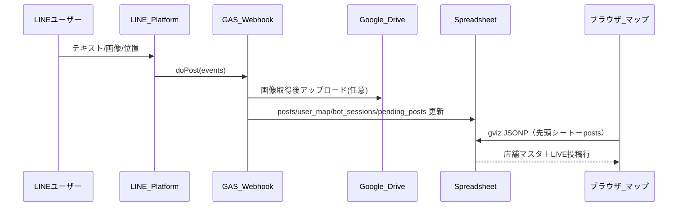

# LINE 連携の仕様（現状整理）

実装の正は [gas-line-webhook.js](gas-line-webhook.js) とメイン [index.html](index.html) の `PostsModule` です。改修する際は**両方**の列順・ロール名・`sourceType` の整合を保ってください。

---

## 1. 全体の流れ

- **受信**: Messaging API の Webhook が GAS の `doPost` に POST。`event.source.userId` が **ユーザーを一意に識別するキー**（LINE のユーザID。チャネル単位で不変）。
- **書き込み**: 承認済みユーザーだけが `posts` に1行追加。画像は Drive に保存し、**サムネイル URL** を `imageUrl` に格納。
- **表示**: フロントは同じスプレッドシート ID で **公開設定された**シートを `gviz/tq` で JSONP 取得。店舗マスタは**先頭シート**、`posts` は `sheet=posts` パラメータ（設定は `CONFIG.POSTS_SHEET`）。

---

## 2. ユーザー認識と登録

### 2.1 識別子

| 何 | 使い道 |
|----|--------|
| **LINE `userId`** | Webhook の `event.source.userId`。`user_map`・`posts.userId`・セッション・保留テキストのキー。プロフィール名は使わない。 |
| **管理者** | スクリプトプロパティ `ADMIN_LINE_USER_ID` が **同一文字列**のときのみ、管理者コマンド（ユーザー一覧・削除など）が使える。 |

未登録または `user_map` で `is_active` が FALSE のユーザーは、投稿処理に入る前に「未登録」案内のみ（`buildUnknownUserMessage`）。

### 2.2 `user_map` シート

論理列（ヘッダーは GAS 作成時の英名）:

| 列 | フィールド | 内容 |
|----|------------|------|
| A | `userId` | LINE ユーザID |
| B | `role` | `store` / `operator` / `contributor`（**英字**。旧形式では B が `store_id` のみ＝店舗行として解釈される互換あり） |
| C | `fixed_store_id` | **店舗ロールのみ**: マスタ先頭シートの `store_id` と対応 |
| D | `is_active` | `FALSE` なら利用停止 |
| E | `display_name` | 現コードでは投稿フロー未使用 |
| F | `registered_at` | 登録日時 |

**登録コマンド（テキスト）**

- **「登録」**: クイックリプライで **協力** / **店舗** の2ボタン。協力はそのまま協力者として登録（`REGISTRATION_PASSWORD` 済み運用は従来どおりパスワードの別メッセージ可）。**店舗**はあと1通で店舗名（マスタの `store_id` と同じ表記）。省略手順: `登録 店舗 風まち` の1通、`店　風まち` / `店舗　風まち`、または `店` または `店舗` だけ送ったあとに店舗名1通。
- **店舗（詳細）**: `store_id` は **マスタ先頭シートの store_id 列と同じ表記**（日本語可）。`登録　風まち` のように **全角スペース**でも可。GAS・フロントは **連続空白を1つに正規化**して比較。最大64文字。**`REGISTRATION_PASSWORD` 設定時は**店舗名送信の **次のメッセージでパスワードのみ**（従来どおり）。
- **運営**: `登録 運営` または `登録 operator`。管理者 LINE ID はそのまま完了。**パスワード必須時**は続けて別メッセージでパスワード（1行にまとめることも可）。
- **協力者**: `登録 協力` / `登録 協力者` / `登録 contributor`。同上。
- **確認**: `登録確認` / **解除**: `登録解除`
- **自分のID**: `マイID` / `my id`

---

## 3. ロール別：テキスト・画像の受け渡し

共通の制約（GAS 定数）:

- テキスト **最大 50 文字**（超過分は切り捨て）。
- 画像 **約 5MB 上限**（超過でエラー）。
- **保留テキスト**（`pending_posts`）の有効期限 **3 分**。期限切れ後、テキストだけ残っている場合はロールに応じて自動で次ステップへ進む（プッシュ通知）。

### 3.1 店舗（`store`）

- **固定投稿**: スプレッドシート**先頭シート**（店舗マスタ）の `store_id` と緯度経度から座標を解決（`sourceType`: `fixed`）。コード上は列インデックス固定（`MASTER_COL_STORE_ID` など）。
- **移動（GPS）投稿**: LINE の **位置メッセージ**を先に送り、その後は協力者と同様に短文・画像・カテゴリ。`posts` は `sourceType`: **`gps`**、**`storeId`** はその店の `fixed_store_id`（現在地の lat/lng）。マップ上は **モバイル LIVE** 経路で表示。
- **固定フローに戻す**: 位置送付後の移動フロー中に、**店の通常の短文**（位置なしの固定投稿）に切り替えるときは、そのテキスト送信時に移動用セッションが捨てられ、従来の pending → 固定投稿フローへ移る。
- **流れ（固定）**: テキスト → `pending_posts` に保存。続けて画像で **テキスト＋画像をマージ** → セッション `awaiting_category` → クイックリプライでカテゴリ（`カテゴリ:◯◯` 形式のメッセージ）→ `posts` 1行。
- **画像のみ**から始めた場合も、カテゴリ選択まで進む（テキスト空可）。

### 3.2 運営（`operator`）

- **座標**: `venue_spots` シートのスポット一覧から **番号**（ユーザーがテキストで送信）で選択。
- **流れ**: テキスト → 保留。画像受信で **テキスト＋画像マージ** → `awaiting_spot` → 番号返信 → `awaiting_category` → 確定。
- **テキストのみ**が期限切れすると、自動でスポット一覧がプッシュされる（位置メッセージは使わない）。

### 3.3 協力者（`contributor`）

- **必須**: 最初に LINE の **位置メッセージ**。これで `bot_sessions` に緯度経度が入り、`awaiting_content` 相当になる。
- **流れ**: 位置 → テキスト（保留）と/または **画像**（`message.id` で LINE Data API から取得）→ マージ後 `awaiting_category` → 確定。
- **座標**: 位置メッセージの **GPS** が `posts` の `lat`/`lng` に使われる（`sourceType`: `gps`）。

### 3.4 画像の保存形式

- `GET https://api-data.line.me/v2/bot/message/{messageId}/content` でバイナリ取得。
- Google Drive フォルダ `LINE_MAP_IMAGES` に保存。**リンク共有（知っている全員）**。
- `posts.imageUrl` に入る文字列は **`https://drive.google.com/thumbnail?id={fileId}&sz=w800`** 形式（フロントの `normalizeImageUrl` と相性を確認すること）。

### 3.5 会話状態の保持

| シート | 役割 |
|--------|------|
| `bot_sessions` | `userId`, `step`, `payload_json`（テキスト仮・画像URL・lat/lng・spot 等） |
| `pending Posts`（`pending_posts`） | テキスト先行時の短時間バッファ（`userId`, `store_id` キー列, `message`, `saved_at`） |

`step` の例: `idle`, `awaiting_content`, `awaiting_spot`, `awaiting_category`, `awaiting_register_store_id`（店舗ID待ち・未登録向け）, `awaiting_registration_password`（登録パスワードの別送信用・パスワード設定時）ほか（定数は `gas-line-webhook.js` 参照）。

---

## 4. `posts` シート（マップとの契約）

GAS の `appendPostRow` の列順と、フロント `_parse` は **同じ並び**です。

| 列 index | フィールド | 備考 |
|----------|------------|------|
| 0 | `postId` | UUID |
| 1 | `userId` | LINE ユーザID |
| 2 | `role` | `store` / `operator` / `contributor` |
| 3 | `sourceType` | `fixed`（店舗・マスタ座標）/ `gps`（協力者・**または店舗の移動投稿**）/ `selected`（運営・スポット選択） |
| 4 | `category` | GAS 側定数 `CATEGORIES` のいずれか |
| 5 | `text` | 本文 |
| 6 | `imageUrl` | Drive サムネ URL 等 |
| 7 | `lat` | 表示緯度 |
| 8 | `lng` | 表示経度 |
| 9 | `storeId` | 店舗紐付け。**`fixed`** で必須。**`gps` の店舗移動投稿**でも `fixed_store_id` が入る（協力者の GPS は空） |
| 10 | `spotId` | 運営スポット ID（任意） |
| 11 | `createdAt` | 作成日時 |
| 12 | `expiresAt` | この時刻を過ぎた行はフロントで無視 |
| 13 | `isVisible` | `FALSE` ならマップに出さない（モデレーション） |

**表示側の振り分け（index.html）**

- `sourceType === 'fixed'` かつ `storeId` あり → 店舗ピンの **live 表示**用 `postsByStoreId`（カテゴリ＋店舗で最新1件に圧縮）。
- `sourceType === 'gps'` または `selected` → 地図上の **モバイル LIVE ピン**一覧 `liveStandalonePosts`。

**TTL（GAS）**（投稿からの掲載目安）

- 店舗: 6 時間 / 運営: 3 時間 / 協力者: 1 時間（`TTL_MS`）。

---

## 5. カテゴリ

GAS の `CATEGORIES` と一致する必要があります（クイックリプライは `カテゴリ:グルメ` のようなテキストを送信）。

現状の一覧: `グルメ`, `混雑`, `景色`, `ステージ`, `子連れ`, `お知らせ`。

フロントで別カテゴリを増やす場合は **GAS の配列とクイックリプライ生成**も合わせて変更。

---

## 6. 秘密情報と環境変数（GAS）

スクリプトプロパティ（`logWebhookScriptPropertyKeys` 参照）:

| キー | 必須 | 内容 |
|------|------|------|
| `SHEET_ID` | はい | 対象スプレッドシート |
| `LINE_CHANNEL_ACCESS_TOKEN` | はい | 長期チャネルアクセストークン（返信・画像取得・プッシュ） |
| `ADMIN_LINE_USER_ID` | 任意 | 管理者の LINE userId |
| `REGISTRATION_PASSWORD` | 任意 | 運営・協力・店舗登録のガード。空なら店舗は（store_id 形式が良ければ）パスワードなし可 |

フロント（`secrets.local.js`）:

- `SHEET_ID` … gviz のベース（**Webhook と同じ表を公開共有**していることが前提）。
- `POSTS_SHEET` … 既定 `posts`（GAS の `POSTS_SHEET_NAME` と一致させる）。

---

## 7. リッチメニュー（登録 / ヘルプ / マップ）

**作成場所**は LINE（[LINE Developers](https://developers.line.biz/) または [公式アカウントマネージャー](https://manager.line.biz/)）のリッチメニュー設定。**Webhook 側のコード変更は不要**（メッセージアクションなら既存の `doPost` → `message` 処理のまま）。

**テンプレート画像**: リポジトリに [public/line-rich-menu-3btn.svg](public/line-rich-menu-3btn.svg)（**2500×843** ・横3等分の目安付き）と、Pencil から書き出した **[public/line-rich-menu-3btn.png](public/line-rich-menu-3btn.png)**（同寸・LINE アップロード用）を置いてある。

### 推奨: 3 ボタン（横 1 行×3 など）

| 画面上のラベル（任意） | アクション | 設定 | `gas-line-webhook.js` との関係 |
|------------------------|------------|------|-------------------------------|
| ヘルプ | **メッセージ** | 送信テキストは **`ヘルプ` のみ**（`help` にしない） | `^ヘルプ$` で `buildHelpMessage` |
| 登録 | **メッセージ** | 送信テキストは **`登録` のみ** | `^登録` → `handleRegisterCommand`（続きが無いので使い方テキスト） |
| マップを開く 等 | **URI** | 本番の **`https://…` のマップ URL**（例: GitHub Pages の `index.html`） | Webhook 不要（ブラウザで開くだけ） |

- **マップ URL** はリポジトリに固定値が無いため、運営が本番 URL を決めて LINE の URI に貼る。**秘密 URL をドキュメントや公開リポジットにコミットしない**運用でよい。
- **英語 `help`** はリッチメニューからは送らない（別途チャットで手入力すれば既存どおり動く）。
- **「店」「登録 風まち」等**はこれまでどおり手入力で利用でき、リッチメニューと競合しない。

### LINE 側の手順（要約）

1. チャネルに合わせてリッチメニュー用画像を用意（上記 SVG を PNG 化するか自作。[Messaging API のリッチメニュー](https://developers.line.biz/ja/docs/messaging-api/using-rich-menus/)の画像サイズ・タップ領域に従う）。**横3ボタン**ならタップ領域は左から幅 **833 / 834 / 833 px**（合計 2500）× 高さ **843** が目安。
2. 各タップ領域に上表どおり **メッセージ / メッセージ / URI** を割り当てる。
3. メニューを **デフォルトでリンク**（検証用チャネルで試してから本番友だちへ）。

### 検証

- テスト用 LINE アカウントで: **ヘルプ**タップ → ヘルプ応答、**登録**タップ → 登録の使い方応答、**マップ**タップ → 指定 URL が開く。

### 将来メモ

- タップで **`postback`** に切り替える場合は、`doPost` で `event.type === 'postback'` を処理するコード追加が必要（現状は未実装）。
- ロール別にメニュー画像を出し分けるにはユーザーごとの `richmenu` リンクなど運用が重くなるため、まず **全員共通メニュー**を推奨。

---

## 8. 管理者向け LINE コマンド

`ADMIN_LINE_USER_ID` と送信者の `userId` が一致するときのみ:

- `ユーザー一覧`
- `削除 {store_id または userId の先頭一致}`
- `テスト投稿` … 管理者自身が店舗登録済みで `fixed_store_id` がある場合、`posts` にテスト行

---

## 9. 変更しやすい拡張ポイント（メモ）

- **文字数・画像サイズ・保留時間・TTL**: `gas-line-webhook.js` 上部の定数。
- **カテゴリ**: `CATEGORIES` と `index.html` の LIVE UI 表記。
- **店舗マスタ列位置**: `MASTER_COL_*`（マスタシートレイアウトを変えるとき要確認）。
- **画像 URL 形式**: Drive 以外の CDN に変えるなら、CORS・サムネ規格と `normalizeImageUrl` を確認。
- **新ロール**: `ROLES`・登録コマンド・`finalizePostWithCategory` の分岐・フロント `_parse` の扱いを追加。

---

## 10. 関連ファイル

| ファイル | 内容 |
|----------|------|
| [gas-line-webhook.js](gas-line-webhook.js) | Webhook、全シート读写、LINE API |
| [index.html](index.html) | `PostsModule._parse`、LIVE ピン合成 |
| [secrets.example.js](secrets.example.js) | フロント用プレースホルダ |
| [SECURITY.md](../SECURITY.md) | 秘密情報の扱い |
