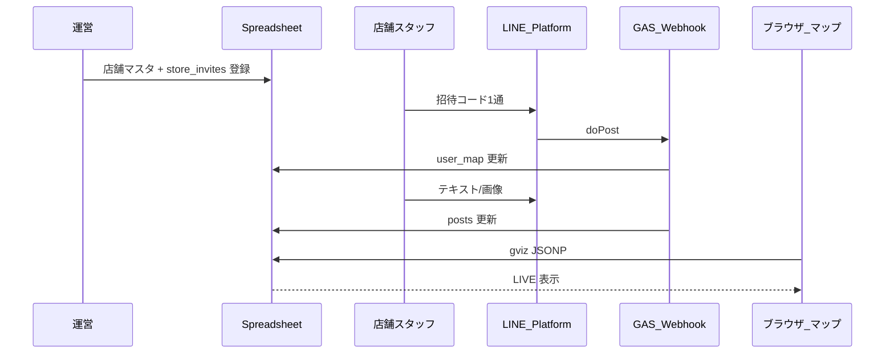

# LINE 連携の仕様（外浦MAP）

**契約の正本:** [line-contract.js](line-contract.js)（シート名・列 index・ロール・sourceType）

**運用・導入資料（店舗向け）:** [docs/LINE_ONBOARDING.md](docs/LINE_ONBOARDING.md)

| 実装 | 役割 |
|------|------|
| [line-contract.js](line-contract.js) | フロント用契約（`config.js` が読み込み） |
| [gas-line-webhook.js](gas-line-webhook.js) 先頭 `LINE_*` | GAS 用契約（**`gas/line-webhook/` から自動生成**・単体デプロイ用にコピー保持） |
| [index.html](index.html) `PostsModule` | posts シートの gviz 読み取り |

改修時は **line-contract.js と GAS の `LINE_*` を同期**し、列順・ロール名・`sourceType` の整合を保ってください。

---

## 1. 全体の流れ

- **受信**: Messaging API の Webhook が GAS の `doPost` に POST。`event.source.userId` が **ユーザーを一意に識別するキー**。
- **紐づけ**: 運営が `store_invites` にコードを発行。スタッフは **コード1通** で `user_map` に登録。
- **書き込み**: 登録済み **店舗** ユーザーのみが `posts` に1行追加（`sourceType: fixed`）。画像は Drive に保存。
- **表示**: フロントは同じスプレッドシート ID で `gviz/tq` 取得。店舗マスタは**先頭シート**、`posts` は `sheet=posts`。

---

## 2. 運営による店舗登録

### 2.1 店舗マスタ（先頭シート）

運営が `name`, `lat`, `lng`, `store_id`（L列 / index 11）を登録。座標・店舗情報は **LINE では変更しない**。

### 2.2 `store_invites` シート（新規）

| 列 | フィールド | 内容 |
|----|------------|------|
| A | `invite_code` | 共有コード（例: `FUMA7K`、大文字小文字無視） |
| B | `store_id` | マスタの `store_id` と一致 |
| C | `is_active` | `FALSE` で無効化 |
| D | `max_uses` | `0` = 無制限、正の整数 = 上限人数 |
| E | `use_count` | GAS が紐づけ成功時に +1（運営は触らない） |
| F | `expires_at` | 空 = 無期限 |
| G | `created_at` | 任意 |
| H | `note` | メモ |

**運営チェックリスト（1店舗）**

1. 店舗マスタに行追加（`store_id`, `lat`, `lng` 必須）
2. `store_invites` にコード行を追加
3. スタッフへ公式 LINE + 招待コードを共有
4. スタッフ追加時は **同じ共有コード** を再送（`max_uses` / 期限の範囲内）
5. 退職時は `user_map` の該当行を削除、または本人が `登録解除`

---

## 3. スタッフの初回紐づけ

未登録ユーザーが送れる入力:

- `FUMA7K`（コード単体）
- `紐づけ FUMA7K` / `はじめます FUMA7K`

成功時: `user_map` に `role=store`, `fixed_store_id` を書き込み。以降は通常投稿可能。

**廃止**: 店舗名入力、位置情報送信、セルフ「登録」コマンド、`REGISTRATION_PASSWORD`

---

## 4. `user_map` シート（複数スタッフ対応）

| 列 | フィールド | 内容 |
|----|------------|------|
| A | `userId` | LINE ユーザ ID |
| B | `role` | `store`（`contributor` は将来の一般ユーザー用・現状未使用） |
| C | `fixed_store_id` | マスタの `store_id` |
| D | `is_active` | `FALSE` なら利用停止 |
| E | `display_name` | 未使用 |
| F | `registered_at` | 紐づけ日時 |
| G | `linked_via` | 使用した `invite_code`（任意・監査用） |

- **同一 `store_id` に複数 userId 可**（N:1）
- **同一 userId は1店舗のみ**

---

## 5. 店舗投稿フロー（fixed のみ）

| 項目 | 仕様 |
|------|------|
| 順番 | テキスト → 📸写真（写真任意） |
| テキスト | 1行目=タイトル(14字)、2行目以降=本文(50字) |
| 座標 | 常にマスタの lat/lng（`sourceType: fixed`） |
| 📍位置情報 | **店舗ロールでは拒否**（固定位置案内のみ） |
| 保留 | `pending_posts` 1分。期限切れで自動確定 |

---

## 6. `posts` シート（12列）

| index | フィールド | 備考 |
|-------|------------|------|
| 0 | `postId` | UUID |
| 1 | `userId` | LINE userId |
| 2 | `role` | `store` |
| 3 | `sourceType` | 店舗は `fixed` のみ |
| 4 | `title` | タイトル |
| 5 | `text` | 本文 |
| 6 | `imageUrl` | Drive サムネ URL |
| 7–8 | `lat` / `lng` | 表示座標 |
| 9 | `storeId` | 店舗紐付け |
| 10 | `createdAt` | 作成日時 |
| 11 | `isVisible` | `FALSE` で非表示 |

**フロント表示**

- `sourceType === 'fixed'` + `storeId` → **店舗ごと最新1件**（LIVE バッジ・かわら版）
- `sourceType === 'gps'` → 将来の一般ユーザー用（`ENABLE_STANDALONE_LIVE_PINS: false`）

---

## 7. スタッフ向けコマンド

| コマンド | 動作 |
|----------|------|
| `マイID` | userId と紐づけ状況 |
| `ヘルプ` | 紐づけ・投稿手順 |
| `登録確認` | 店舗名・有効/無効 |
| `登録解除` | 紐づけ解除 |

---

## 8. 管理者コマンド

`ADMIN_LINE_USER_ID` 一致時のみ:

| コマンド | 動作 |
|----------|------|
| `ユーザー一覧` | 全 `user_map` 行（同一店舗が複数行表示可） |
| `削除 {store_id}` | その店舗の **全スタッフ** を削除 |
| `削除 {userId先頭}` | userId 前方一致で削除 |
| `テスト投稿` | 管理者の店舗座標でテスト行追加 |

---

## 9. 将来拡張（一般ユーザー GPS）

温存しているコード:

- `ROLE_CONTRIBUTOR` + GPS 投稿ハンドラ
- `sourceType: gps` + `liveStandalonePosts`
- `ENABLE_STANDALONE_LIVE_PINS` フラグ

有効化時は別招待体系（例: `visitor_invites`）を想定。

---

## 10. 秘密情報（GAS）

| キー | 必須 | 内容 |
|------|------|------|
| `SHEET_ID` | はい | 対象スプレッドシート |
| `LINE_CHANNEL_ACCESS_TOKEN` | はい | 長期チャネルアクセストークン |
| `ADMIN_LINE_USER_ID` | 任意 | 管理者 LINE userId |

フロント（`secrets.local.js`）: `SHEET_ID`, `MAPBOX_TOKEN`。

---

## 11. 移行メモ

| 対象 | 対応 |
|------|------|
| 既存 `user_map` 行 | そのまま有効 |
| 旧「登録」コマンド | 招待コード案内にリダイレクト |
| `REGISTRATION_PASSWORD` | 廃止（プロパティは放置可） |

---

## 12. デプロイ時チェックリスト

1. GAS スクリプトプロパティに `SHEET_ID` / `LINE_CHANNEL_ACCESS_TOKEN`
2. ソース変更時は `python web/gas/build-line-webhook.py` で `gas-line-webhook.js` を再生成
3. `gas-line-webhook.js` を GAS に貼り付け・**新バージョンでデプロイ**
4. `setupSheets()` または `setupAllSheetsWithDummyData` で `store_invites` シート作成
5. 店舗マスタの `store_id` 列が index 11 であること
6. スプレッドシートを gviz 可能な共有設定に

---

## 13. リッチメニュー（1種類・切替なし）

**GAS はメニュー切替を行いません。** LINE 管理画面で **1枚だけ** 設定します。

**画像:** [assets/rich-menu/rich-menu-store.png](assets/rich-menu/rich-menu-store.png)（2500×1686）  
**詳細:** [assets/rich-menu/README.md](assets/rich-menu/README.md)

### 13.1 ボタン（4つ・全員共通）

| ボタン | アクション | 送信内容 |
|--------|------------|----------|
| ヘルプ | テキスト | `ヘルプ` |
| 例文 | テキスト | 1行目 `本日のおすすめ`、2行目 `（ここに本文）` |
| 登録確認 | テキスト | `登録確認` |
| マップを見る | リンク | `https://stand-koike.github.io/sotoura-map/` |

- テキストアクションは **50字以内**
- **例文** … 紐づけ済み店舗スタッフ向け（テキスト受付 → 続けて写真）。未登録の場合は案内メッセージ
- **初回登録** … 招待コードを手入力（`ヘルプ` に手順あり）。`登録の流れ` と送っても GAS が案内可
- `登録解除` / `マイID` は **手入力**
- 投稿は **テキスト → 写真**（メニューからカメラは開けない）

### 13.2 LINE Official Account Manager 手順

1. [LINE Official Account Manager](https://manager.line.biz/) → **リッチメニュー**
2. **1枚だけ** 作成（2500×1686、2×2）→ 上記4ボタンを設定
3. **デフォルトのリッチメニュー ON** → 公開
4. 表示期間: 開始＝今日、終了＝**2036-12-31** など遠い未来（終了日なしは不可）
5. 旧メニューがある場合は **停止** してから新規公開（表示期間の重複エラーを避ける）

**Collapsed（折りたたみ）** はメニューバーの初期表示だけの設定で、デフォルト ON/OFF とは別です。
