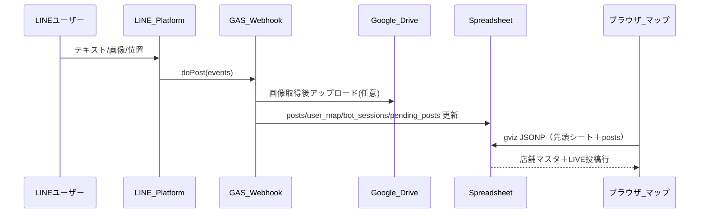

# LINE 連携の仕様（外浦MAP）

実装の正は [gas-line-webhook.js](gas-line-webhook.js) とメイン [index.html](index.html) の `PostsModule` です。改修する際は**両方**の列順・ロール名・`sourceType` の整合を保ってください。

---

## 1. 全体の流れ

- **受信**: Messaging API の Webhook が GAS の `doPost` に POST。`event.source.userId` が **ユーザーを一意に識別するキー**。
- **書き込み**: 登録済み**店舗**ユーザーのみが `posts` に1行追加。画像は Drive に保存し、**サムネイル URL** を `imageUrl` に格納。
- **表示**: フロントは同じスプレッドシート ID で公開設定されたシートを `gviz/tq` で JSONP 取得。店舗マスタは**先頭シート**、`posts` は `sheet=posts`（`CONFIG.POSTS_SHEET`）。

---

## 2. ユーザー認識と登録

### 2.1 識別子

| 何 | 使い道 |
|----|--------|
| **LINE `userId`** | `user_map`・`posts.userId`・セッション・保留テキストのキー |
| **管理者** | スクリプトプロパティ `ADMIN_LINE_USER_ID` が一致するときのみ管理者コマンド可 |

未登録または `user_map` で `is_active` が FALSE のユーザーは投稿不可。

### 2.2 `user_map` シート

| 列 | フィールド | 内容 |
|----|------------|------|
| A | `userId` | LINE ユーザID |
| B | `role` | **`store` のみ**（旧 `operator` / `contributor` 行は投稿不可・再登録を案内） |
| C | `fixed_store_id` | マスタ先頭シートの `store_id` と対応 |
| D | `is_active` | `FALSE` なら利用停止 |
| E | `display_name` | 未使用 |
| F | `registered_at` | 登録日時 |

**登録コマンド**

- **「登録」**: クイックリプライで **店舗** のみ。あと1通で店舗名（マスタの `store_id` と同じ表記）。
- 省略: `登録 店舗 店舗名`、`店　店舗名`、`店舗　店舗名`
- **`REGISTRATION_PASSWORD` 設定時**: 店舗名の次のメッセージでパスワードのみ
- **確認**: `登録確認` / **解除**: `登録解除` / **ID**: `マイID`

店舗はスプレッドシートに事前登録された `store_id` と紐づけます。

---

## 3. 店舗投稿フロー

共通制約:

- テキスト **最大 50 文字**
- 画像 **約 5MB 上限**
- **保留**（`pending_posts`）**1 分**。期限切れでテキストのみ／画像のみは自動確定して `posts` に書き込み

### 3.1 固定投稿（お店の座標）

1. 短文テキスト → `pending_posts` に保存
2. 📸写真（任意）→ マージして即 `posts` 確定
3. 写真不要の場合は pending 期限切れで自動確定

`sourceType`: **`fixed`**。座標はマスタ先頭シートの lat/lng（`MASTER_COL_STORE_ID = 11`、M列・`config.js` の `COLS.STORE_ID` と一致）。

### 3.2 移動（GPS）投稿

1. 📍位置情報を先に送信
2. 短文テキスト → 保留
3. 📸写真（任意）→ 確定

`sourceType`: **`gps`**。`storeId` は `fixed_store_id`。マップ上は店舗ピンまたはモバイル LIVE ピンで表示。

### 3.3 カテゴリ

**ユーザー選択は廃止**。GAS は `DEFAULT_POST_CATEGORY`（`お知らせ`）を自動で `posts.category` に入れます。

### 3.4 画像保存

- LINE Data API で取得 → Drive フォルダ `LINE_MAP_IMAGES`
- `imageUrl`: `https://drive.google.com/thumbnail?id={fileId}&sz=w800`

### 3.5 会話状態

| シート | 役割 |
|--------|------|
| `bot_sessions` | `step`, `payload_json`（テキスト・画像URL・lat/lng 等） |
| `pending_posts` | テキスト先行バッファ |

---

## 4. `posts` シート（マップとの契約）

| 列 index | フィールド | 備考 |
|----------|------------|------|
| 0 | `postId` | UUID |
| 1 | `userId` | LINE ユーザID |
| 2 | `role` | `store` |
| 3 | `sourceType` | `fixed` / `gps` |
| 4 | `category` | 固定値 `お知らせ` |
| 5 | `text` | 本文 |
| 6 | `imageUrl` | Drive サムネ URL |
| 7–8 | `lat` / `lng` | 表示座標 |
| 9 | `storeId` | 店舗紐付け |
| 10 | `spotId` | 未使用 |
| 11 | `createdAt` | 作成日時 |
| 12 | `expiresAt` | 互換用（遠い未来）。**フロントは期限で非表示にしない** |
| 13 | `isVisible` | `FALSE` で非表示 |

**フロント表示（index.html）**

- `sourceType === 'fixed'` かつ `storeId` あり → **店舗ごと最新1件**を `postsByStoreId` に集約（カード・ピンの LIVE バッジ）
- `sourceType === 'gps'` → モバイル LIVE ピン（`liveStandalonePosts`）
- **中央上部ニュースティッカーは非表示**（カード・ピンのみ）

---

## 5. 廃止した機能（外浦MAP）

| 機能 | 状態 |
|------|------|
| 運営ロール / `venue_spots` | GAS から削除 |
| 協力者登録 | 受付停止（店舗のみ） |
| 投稿カテゴリ選択 | 廃止（固定カテゴリ） |
| 掲載 TTL（数時間で消える） | 廃止（最新1件表示・行は残す） |
| 神轎レイヤー | フロントから削除 |
| 祭スケジュール（`event_schedule`） | フロントから削除（将来拡張余地あり） |

---

## 6. 秘密情報（GAS）

| キー | 必須 | 内容 |
|------|------|------|
| `SHEET_ID` | はい | 対象スプレッドシート |
| `LINE_CHANNEL_ACCESS_TOKEN` | はい | 長期チャネルアクセストークン |
| `ADMIN_LINE_USER_ID` | 任意 | 管理者 LINE userId |
| `REGISTRATION_PASSWORD` | 任意 | 店舗登録パスワード（空なら不要） |

フロント（`secrets.local.js`）: `SHEET_ID`, `MAPBOX_TOKEN`。`POSTS_SHEET` 既定 `posts`。

---

## 7. デプロイ時チェックリスト

1. GAS スクリプトプロパティに `SHEET_ID` / `LINE_CHANNEL_ACCESS_TOKEN`
2. `gas-line-webhook.js` を GAS プロジェクトに貼り付け・**新バージョンでデプロイ**
3. `MASTER_COL_STORE_ID = 11` が実シートの `store_id` 列と一致していること
4. スプレッドシートを「リンクを知っている全員が閲覧可」または gviz 可能な共有設定
5. フロント `config.js` の `COLS` と店舗マスタ列が一致
