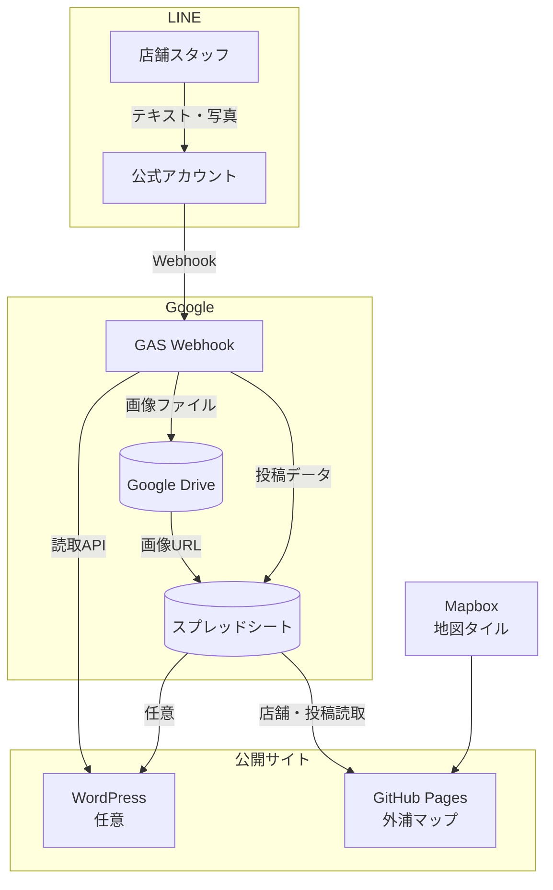

# 外浦MAP — クライアント受け渡し資料

外浦MAP（地図サイト + LINE かわら版）を **御社アカウントへ引き継ぐ** ときに必要な情報を、非エンジニアの方にも読めるよう整理した資料です。

**読者:** プロジェクト責任者・運営担当・引き継ぎ先のエンジニア  
**最終更新:** 2026-06-23

---

## この資料で分かること

1. システム全体が **何のアカウント・サービスで動いているか**
2. 引き継ぎ時に **移管が必要なもの一覧**
3. LINE 投稿画像が **どこに保存されるか**
4. 引き継ぎ後 **最初に確認すべきチェックリスト**

---

## 1. システム全体像

外浦MAP は、次の 5 つが連携して動いています。

| 役割 | サービス | 何をしているか |
|------|----------|----------------|
| **地図の表示** | GitHub Pages + Mapbox | ブラウザでイラスト地図と店舗ピンを表示 |
| **店舗データ** | Google スプレッドシート | 店名・座標・説明文などを管理 |
| **LINE 投稿** | LINE + Google Apps Script (GAS) | スタッフの投稿を受け取り、シートに書き込む |
| **投稿画像** | Google Drive | LINE で送られた写真を保存 |
| **WordPress 表示** | WordPress + GAS（任意） | かわら版を WP サイトにも表示 |

---

## 2. 引き継ぎ対象一覧（移管チェックリスト）

引き継ぎ時は、下表の **所有権・ログイン・秘密情報** を御社アカウントへ移してください。

### 2.1 必須（これがないと動かない）

| # | 対象 | 移管内容 | 確認 |
|---|------|----------|:----:|
| 1 | **Google スプレッドシート** | 編集権限の移管（またはコピー後に ID を全設定で差し替え） | ☐ |
| 2 | **Google Drive フォルダ `LINE_MAP_IMAGES`** | 画像フォルダの共有・移管（後述 §4） | ☐ |
| 3 | **Google Apps Script プロジェクト** | Webhook 用 GAS の所有権移管・再デプロイ | ☐ |
| 4 | **GAS スクリプトプロパティ** | `SHEET_ID` / `LINE_CHANNEL_ACCESS_TOKEN` / `ADMIN_LINE_USER_ID` | ☐ |
| 5 | **LINE 公式アカウント** | アカウント管理権限・Messaging API チャネル | ☐ |
| 6 | **LINE Webhook URL** | GAS の Web アプリ URL を LINE Developers に設定 | ☐ |
| 7 | **GitHub リポジトリ** | `sotoura-map` の所有権移管 or 御社 org へ移行 | ☐ |
| 8 | **GitHub Pages** | Source = GitHub Actions、公開 URL の確認 | ☐ |
| 9 | **GitHub Repository Secrets** | `MAPBOX_PUBLIC_TOKEN` / `GOOGLE_SHEET_ID` 等 | ☐ |
| 10 | **Mapbox アカウント** | 公開トークン `pk.*` の発行・URL 制限の更新 | ☐ |

### 2.2 運用データ（中身ごと引き継ぐ）

| シート名 | 内容 |
|----------|------|
| **先頭シート**（店舗マスタ） | 店名・座標・`store_id`・説明文など |
| **`store_invites`** | 店舗スタッフ用招待コード |
| **`user_map`** | LINE ユーザーと店舗の紐づけ（GAS が自動更新） |
| **`posts`** | かわら版投稿履歴（テキスト・画像 URL・日時） |
| **`bot_sessions`** / **`pending_posts`** | 投稿途中の一時データ（GAS が自動更新） |

列の詳細: [clients/sotoura/production/README.md](../../clients/sotoura/production/README.md)

### 2.3 設定・素材

| 対象 | 場所 | 備考 |
|------|------|------|
| 地図画像 | `web/map.webp` | 本番用イラスト地図 |
| 地図座標・表示設定 | `web/config.js` | タイトル・座標・列定義など |
| リッチメニュー画像 | `web/assets/rich-menu/rich-menu-store.png` | LINE 管理画面に再アップロード |
| 原稿素材 | `clients/sotoura/production/` | PNG / 座標ファイル（再編集用） |

### 2.4 任意（使っている場合のみ）

| 対象 | 資料 |
|------|------|
| WordPress かわら版ウィジェット | [WORDPRESS_INTEGRATION.md](./WORDPRESS_INTEGRATION.md) |
| Google Analytics (GA4) | `web/config.js` の `GA_MEASUREMENT_ID` |

---

## 3. 各サービスの詳細

### 3.1 Google スプレッドシート

**役割:** 店舗マスタ・LINE 投稿・招待コードなど、すべてのデータの正本。

| 設定項目 | 内容 |
|----------|------|
| 共有 | **「リンクを知っている全員が閲覧可」**（地図サイトが読み取るため必須） |
| 編集 | 運営担当 + GAS 実行アカウント |

**運営が日常触るシート**

- 先頭シート … 店舗の追加・座標・説明文
- `store_invites` … 招待コードの発行

**GAS が自動更新するシート**

- `user_map` / `posts` / `bot_sessions` / `pending_posts`

店舗スタッフ向け手順: [LINE_ONBOARDING.md](./LINE_ONBOARDING.md)

---

### 3.2 Google Apps Script（LINE Webhook）

**役割:** LINE からのメッセージを受け取り、スプレッドシートへ書き込む。画像は Drive に保存。

| 項目 | 内容 |
|------|------|
| ソース（編集用） | `web/gas/line-webhook/` 内の 7 ファイル |
| デプロイ用ファイル | `web/gas-line-webhook.js`（ビルドで自動生成） |
| エントリ | `doPost`（LINE Webhook）/ `doGet?action=posts`（読取 API） |

**スクリプトプロパティ（GAS「プロジェクトの設定」→「スクリプトプロパティ」）**

| キー | 必須 | 内容 |
|------|:----:|------|
| `SHEET_ID` | ✅ | 対象スプレッドシート ID |
| `LINE_CHANNEL_ACCESS_TOKEN` | ✅ | LINE 長期チャネルアクセストークン |
| `ADMIN_LINE_USER_ID` | — | 管理者用 LINE userId（任意） |

> ⚠️ トークンや ID は **ソースコードに書かない** でください。必ずスクリプトプロパティに登録します。

**Web アプリのデプロイ設定**

| 項目 | 推奨値 |
|------|--------|
| 実行ユーザー | デプロイした Google アカウント |
| アクセス | **全員**（匿名ユーザーを含む） |

デプロイ後に控える URL:

- **Webhook 用（LINE に登録）:** `https://script.google.com/macros/s/________/exec`
- **読取 API 用（WordPress 等）:** 同じ URL + `?action=posts`

技術詳細: [LINE_INTEGRATION.md](../LINE_INTEGRATION.md) / [gas/README.md](../gas/README.md)

---

### 3.3 LINE 公式アカウント

**役割:** 店舗スタッフがかわら版を投稿する窓口。

| 設定箇所 | 内容 |
|----------|------|
| LINE Developers | Messaging API チャネル・Webhook URL・チャネルアクセストークン |
| LINE Official Account Manager | リッチメニュー・友だち追加導線 |

**リッチメニュー（1 枚・全員共通）**

| ボタン | 動作 |
|--------|------|
| ヘルプ | 「ヘルプ」を送信 |
| 例文 | 投稿例テキストを送信 |
| 登録確認 | 「登録確認」を送信 |
| マップを見る | **地図サイト URL へリンク**（引き継ぎ時に URL を差し替え） |

画像ファイル: `web/assets/rich-menu/rich-menu-store.png`（2500×1686）  
設定手順: [assets/rich-menu/README.md](../assets/rich-menu/README.md)

---

### 3.4 GitHub Pages（地図サイト）

**役割:** 一般ユーザー向けの外浦マップを公開。

| 項目 | 内容 |
|------|------|
| リポジトリ | `sotoura-map` |
| 公開フォルダ | `web/` |
| デプロイ方法 | GitHub Actions（`main` ブランチへ push で自動） |
| 公開 URL 例 | `https://stand-koike.github.io/sotoura-map/` |

**GitHub Repository Secrets（Settings → Secrets → Actions）**

| Secret 名 | 必須 | 内容 |
|-----------|:----:|------|
| `MAPBOX_PUBLIC_TOKEN` | ✅ | Mapbox 公開トークン `pk.*` |
| `GOOGLE_SHEET_ID` | ✅ | スプレッドシート ID |
| `POSTS_SHEET` | — | 投稿シート名（省略時 `posts`） |
| `EVENTS_SHEET` | — | イベントシート名（省略時 `event_schedule`） |

Secrets はビルド時に `web/secrets.local.js` を自動生成します（Git には含まれません）。

初回セットアップ: [SETUP_GITHUB.md](../../SETUP_GITHUB.md)

---

### 3.5 Mapbox

**役割:** 地図のベースタイル（背景地図）の表示。

| 項目 | 内容 |
|------|------|
| トークン種別 | 公開トークン `pk.*` のみ（秘密鍵 `sk.*` は不要） |
| 設定場所 | GitHub Secrets + ローカル `secrets.local.js` |
| セキュリティ | Mapbox ダッシュボードで **公開 URL を制限** すること |

引き継ぎ時は、御社 Mapbox アカウントで新トークンを発行し、GitHub Secrets を差し替えてください。

---

## 4. LINE 投稿画像の保存先（重要）

店舗スタッフが LINE で送った **写真** は、次の場所に保存されます。

| 項目 | 内容 |
|------|------|
| **保存場所** | **GAS を実行している Google アカウント** の Google Drive |
| **フォルダ名** | **`LINE_MAP_IMAGES`** |
| **作成タイミング** | 初めて画像付き投稿があったときに **自動作成** |
| **ファイル名** | `line_{メッセージID}_{タイムスタンプ}.jpg` |
| **共有設定** | リンクを知っている全員が閲覧可 |
| **シートへの記録** | `posts` シートの `imageUrl` 列に Drive サムネ URL |

**保存の流れ**

1. スタッフが LINE で写真を送信
2. GAS が LINE から画像を取得
3. Drive の `LINE_MAP_IMAGES` フォルダに保存
4. `posts` シートに URL を書き込み
5. 地図サイト・WordPress がその URL で画像を表示

> ⚠️ **注意:** 画像はスプレッドシートの中には入りません。Drive フォルダを削除したり、GAS 実行アカウントを変更しただけでフォルダを移管しないと、**過去投稿の画像が表示されなくなります。**

**引き継ぎ時の対応**

- [ ] GAS 実行アカウントの Drive 内 `LINE_MAP_IMAGES` を確認
- [ ] フォルダごと御社 Google アカウントへ共有、またはアカウント移管
- [ ] `posts` シートの `imageUrl` が引き続き有効か、地図上で数件確認

---

## 5. 秘密情報の一覧（どこに何があるか）

| 情報 | 置き場所 | Git に含める？ |
|------|----------|:--------------:|
| Mapbox 公開トークン | GitHub Secrets / `secrets.local.js` | ❌ |
| スプレッドシート ID | GitHub Secrets / GAS スクリプトプロパティ | ❌ |
| LINE チャネルアクセストークン | GAS スクリプトプロパティのみ | ❌ |
| 管理者 LINE userId | GAS スクリプトプロパティのみ | ❌ |
| GAS Web アプリ URL | LINE Developers / WordPress 設定 | 公開可（読取のみ） |

サンプルファイル（値はプレースホルダ）:

- `web/secrets.example.js` → ローカル用に `secrets.local.js` へコピー

詳細: [SECURITY.md](../../SECURITY.md)

---

## 6. 引き継ぎ作業の推奨手順

順番の目安です。実際の作業はエンジニアと一緒に進めてください。

### Step 1 — データの確認

- [ ] スプレッドシートの店舗数・投稿数を確認
- [ ] Drive の `LINE_MAP_IMAGES` 内のファイル数を確認
- [ ] 現行の公開 URL（GitHub Pages）で地図・LIVE 投稿が表示されることを確認

### Step 2 — Google 側の移管

- [ ] スプレッドシートの所有者を御社アカウントへ
- [ ] Drive `LINE_MAP_IMAGES` を御社アカウントへ共有 or 移管
- [ ] GAS プロジェクトの所有者を御社アカウントへ
- [ ] スクリプトプロパティ（`SHEET_ID` 等）を確認・必要なら更新
- [ ] GAS を **新バージョンで再デプロイ** し、新 URL を控える

### Step 3 — LINE の更新

- [ ] LINE Developers で Webhook URL を新 GAS URL に変更
- [ ] チャネルアクセストークンを再発行した場合、GAS プロパティも更新
- [ ] リッチメニューの「マップを見る」リンクを新 Pages URL に変更
- [ ] テスト用招待コードで紐づけ → テキスト → 写真投稿 → 地図表示を確認

### Step 4 — GitHub / Mapbox

- [ ] リポジトリの移管 or 御社 org への転送
- [ ] GitHub Pages（Actions）が成功することを確認
- [ ] Repository Secrets を御社の値に差し替え
- [ ] Mapbox トークンを御社アカウントで発行・URL 制限を更新
- [ ] push 後、公開サイトで地図・ピン・LIVE が表示されることを確認

### Step 5 — 任意・仕上げ

- [ ] WordPress ウィジェットの `gasUrl` を更新（利用時）
- [ ] GA4 測定 ID を御社プロパティに変更（必要時）
- [ ] 旧 Stand 側アカウントから不要な権限を削除
- [ ] **トークン類を再発行**（漏洩リスク低減）

---

## 7. 引き継ぎ後の日常運用（誰が何をするか）

| 担当 | やること | 資料 |
|------|----------|------|
| **運営** | 店舗追加・招待コード発行・退職者の紐づけ解除 | [LINE_ONBOARDING.md](./LINE_ONBOARDING.md) |
| **店舗スタッフ** | 招待コード送信 → テキスト → 写真で投稿 | 同上 |
| **エンジニア** | 地図差し替え・GAS 修正・Pages デプロイ | [web/README.md](../README.md) |
| **エンジニア（WP）** | WordPress 埋め込み・API URL 管理 | [WORDPRESS_INTEGRATION.md](./WORDPRESS_INTEGRATION.md) |

---

## 8. よくあるトラブル

| 症状 | 確認すること |
|------|----------------|
| 地図は出るがピンがない | GitHub Secret `GOOGLE_SHEET_ID` / シート共有設定 |
| LINE 投稿がシートに入らない | Webhook URL・GAS デプロイ・`LINE_CHANNEL_ACCESS_TOKEN` |
| 投稿はあるが画像だけ出ない | Drive `LINE_MAP_IMAGES` の共有・フォルダ移管漏れ |
| スタッフが紐づけできない | `store_invites` のコード・`store_id`・店舗の lat/lng |
| マップ URL が古い | リッチメニューのリンク URL |
| WP にだけ出ない | GAS `?action=posts`・Web アプリ「全員」アクセス設定 |

---

## 9. 関連ドキュメント

| 資料 | 対象読者 |
|------|----------|
| [LINE_ONBOARDING.md](./LINE_ONBOARDING.md) | 運営・店舗スタッフ |
| [LINE_INTEGRATION.md](../LINE_INTEGRATION.md) | エンジニア（LINE 技術仕様） |
| [WORDPRESS_INTEGRATION.md](./WORDPRESS_INTEGRATION.md) | エンジニア（WordPress） |
| [clients/sotoura/production/README.md](../../clients/sotoura/production/README.md) | エンジニア（シート列定義） |
| [SECURITY.md](../../SECURITY.md) | 秘密情報の扱い |
| [SETUP_GITHUB.md](../../SETUP_GITHUB.md) | GitHub Pages 初回設定 |

---

## 10. 引き継ぎ記録（記入用）

引き継ぎ完了時に、担当者が記入してください。

| 項目 | 値 |
|------|-----|
| 引き継ぎ日 | |
| 御社担当者 | |
| スプレッドシート URL | |
| スプレッドシート ID | |
| GAS Web アプリ URL | |
| GitHub リポジトリ URL | |
| 公開地図 URL | |
| LINE 公式アカウント名 | |
| Mapbox アカウント（メール） | |
| WordPress 設置有無 | 有 / 無 |
| 備考 | |

---

*外浦MAP — Stand より引き継ぎ*
