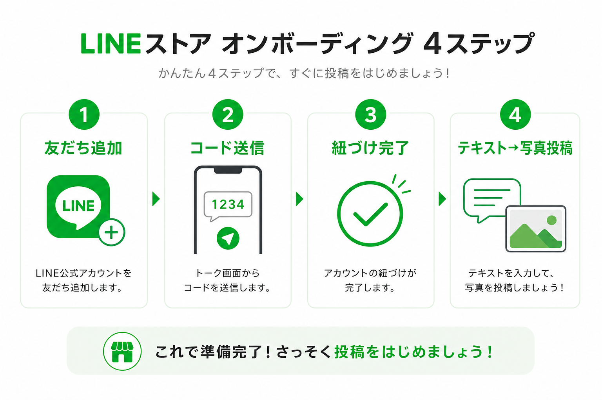
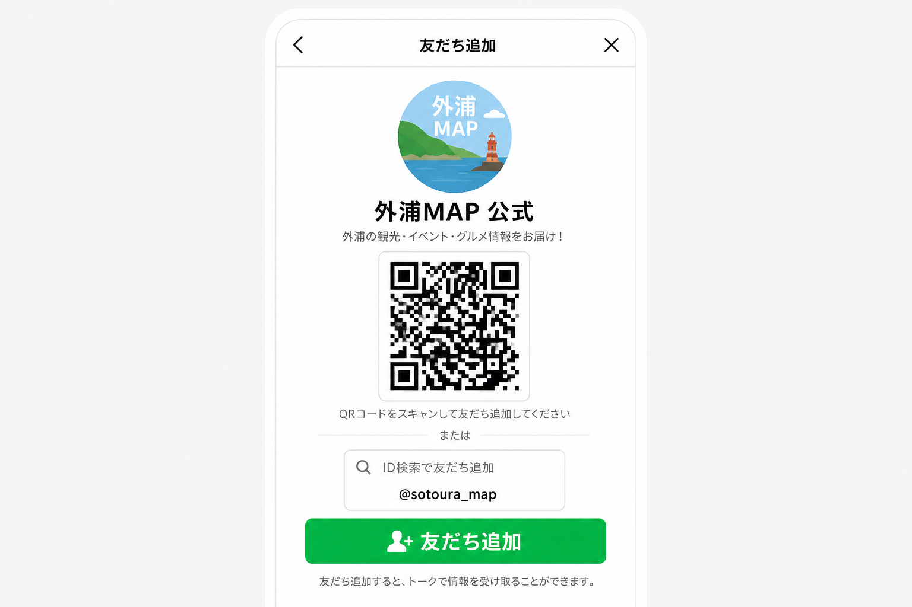
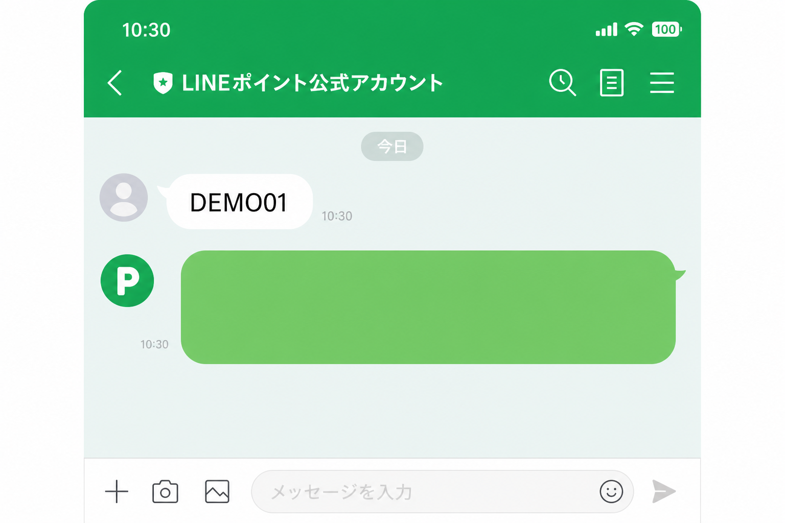
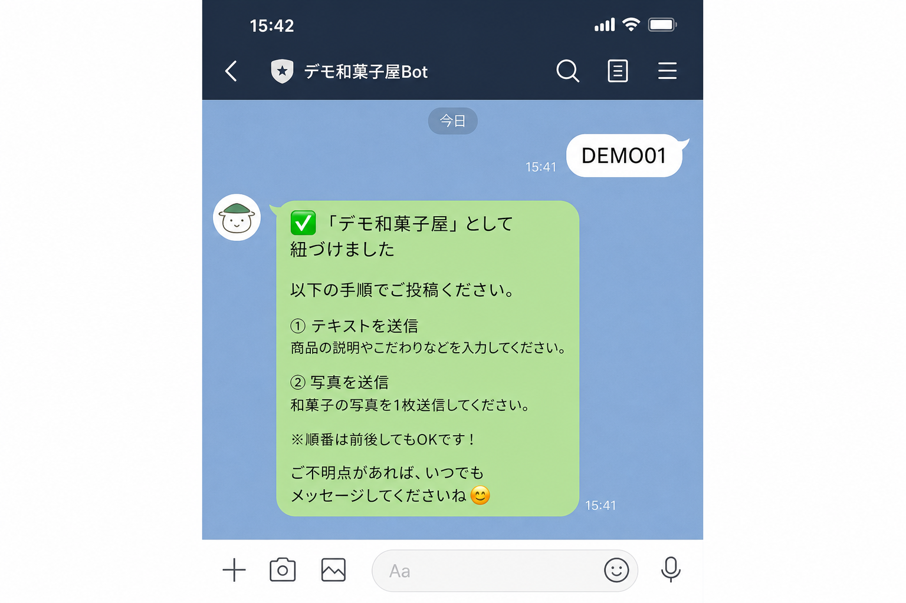
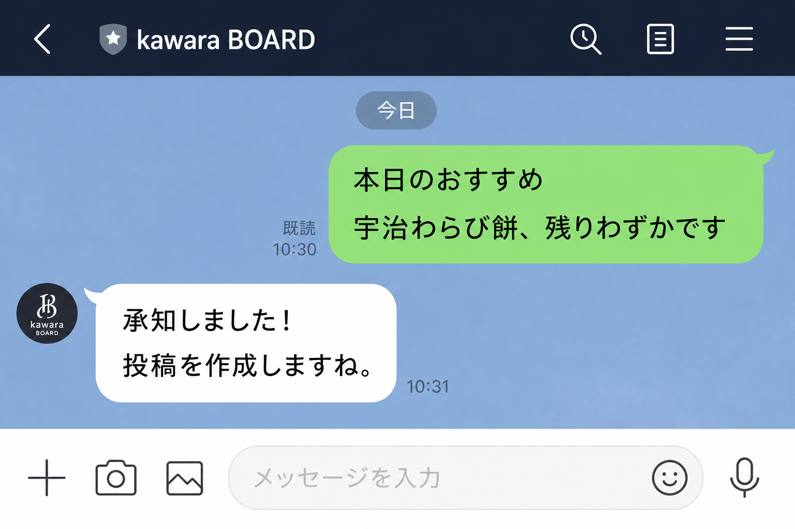
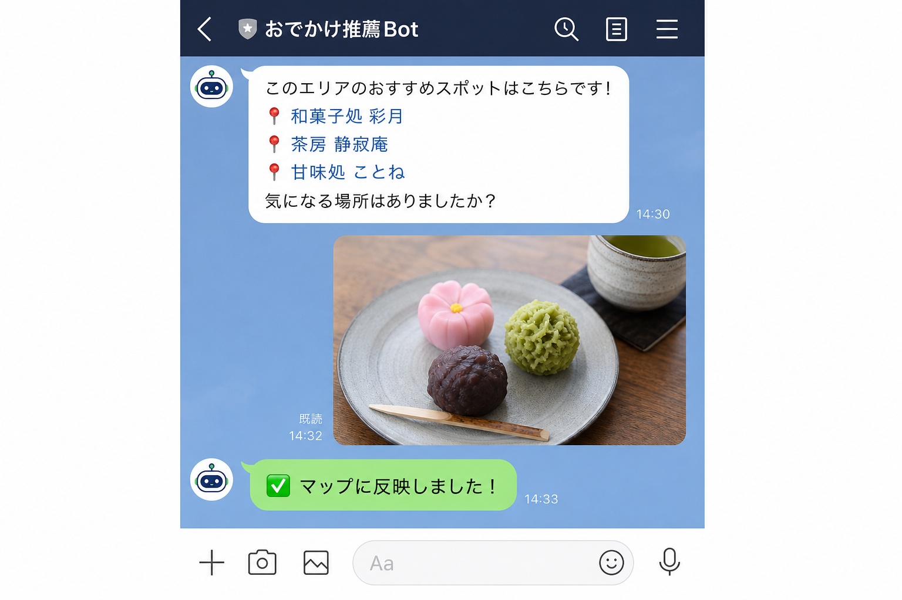

# 外浦MAP — LINE かわら版 登録・投稿 導入資料

店舗スタッフの **LINE 紐づけ** と **かわら版投稿** の運用手順書です。  
スライド化する場合は見出し「## スライド N」を1枚ずつ転記してください。

**関連ドキュメント**

- 技術仕様: [LINE_INTEGRATION.md](../LINE_INTEGRATION.md)
- WordPress 連携: [WORDPRESS_INTEGRATION.md](./WORDPRESS_INTEGRATION.md)
- 運営向け列定義: [clients/sotoura/production/README.md](../../clients/sotoura/production/README.md)
- スプレッドシート: [外浦MAP](https://docs.google.com/spreadsheets/d/16E1nAfvtlVSVCaXfHSfzlAWIAHXeuQWudxFssreehy4/edit)

---

## 全体フロー（概要）



| 誰 | やること |
|----|----------|
| **運営** | 店舗マスタ + `store_invites` に招待コードを登録 |
| **スタッフ（初回）** | 招待コードを **1通** 送信 → 紐づけ完了 |
| **スタッフ（日常）** | **テキスト → 写真** で投稿 → マップ LIVE 表示 |

---

# Part A — 運営向け

## スライド 1：タイトル

**外浦MAP かわら版**  
LINE 登録・投稿 導入ガイド

- 店舗・座標 → **運営がスプレッドシートで管理**
- スタッフ → **招待コード1通** で紐づけ
- 投稿 → **テキスト → 写真**（位置情報は不要）

---

## スライド 2：運営が触るシート

| シート | 誰が入力 | 内容 |
|--------|----------|------|
| **先頭シート**（店舗マスタ） | 運営 | 店名・座標・`store_id` |
| **`store_invites`** | 運営 | 招待コード |
| **`user_map`** | 自動（GAS） | LINE 紐づけ結果 |
| **`posts`** | 自動（GAS） | かわら版投稿 |

---

## スライド 3：店舗マスタ（先頭シート）

**必須項目**

| 列 | 項目 | 例 |
|----|------|-----|
| B | `name` | デモ和菓子屋 |
| C | `lat` | 34.6758 |
| D | `lng` | 138.9412 |
| L | **`store_id`** | `demo-001` |

- `store_id` は `store_invites` の `store_id` と **完全一致**
- `lat` / `lng` が空だと紐づけ・投稿がエラーになる

---

## スライド 4：`store_invites` の入力

**ヘッダー（1行目）**

```
invite_code, store_id, is_active, max_uses, use_count, expires_at, created_at, note
```

**ダミー入力例**

| invite_code | store_id | is_active | max_uses | use_count | note |
|-------------|----------|-----------|----------|-----------|------|
| DEMO01 | demo-001 | TRUE | 0 | 0 | 和菓子屋・全員用 |
| DEMO02 | demo-002 | TRUE | 0 | 0 | カフェ・全員用 |

| 列 | 入力 |
|----|------|
| `invite_code` | 英数字 4〜12 文字 |
| `store_id` | マスタ L列と同じ |
| `is_active` | `TRUE` / `FALSE` |
| `max_uses` | `0` = 無制限 |
| `use_count` | **触らない**（自動加算） |
| `expires_at` | 空 = 無期限 |

---

## スライド 5：新店舗オンボーディング

- [ ] 1. 先頭シートに店舗行（`name`, `lat`, `lng`, `store_id`）
- [ ] 2. `store_invites` にコード行
- [ ] 3. スタッフへ **公式 LINE + コード** を共有
- [ ] 4. コード送信 → `user_map` に行追加を確認
- [ ] 5. テスト投稿 → マップ LIVE を確認

**スタッフ追加** → 同じコードを再共有  
**退職・端末変更** → `user_map` 行削除 or 「登録解除」

---

## スライド 6：トラブルシューティング（運営）

| 症状 | 対処 |
|------|------|
| コードが見つからない | `store_invites` の typo を確認 |
| 座標が未設定 | マスタの lat/lng を入力 |
| 利用上限 | `max_uses` を増やす or 新コード |
| マップに出ない | `posts.isVisible` を TRUE に |
| コード漏洩 | `is_active` = FALSE → 新コード発行 |

---

# Part B — 店舗スタッフ向け

## スライド 7：かわら版とは

- お店から **短文 + 写真** を LINE で送る
- 外浦マップの **お店ピンに LIVE 表示**
- 最新 1 件がカード・地図に反映

---

## スライド 8：LINE 登録シミュレーション

以下の画面イメージどおりに操作してください（**初回のみ**）。

### STEP 1 — 公式 LINE を友だち追加



QR コードまたはリンクから「友だち追加」をタップします。

---

### STEP 2 — 招待コードを 1 通送る

運営から受け取ったコード（例: `DEMO01`）をそのまま送信します。



```
DEMO01
```

「`紐づけ DEMO01`」「`はじめます DEMO01`」でも可。

---

### STEP 3 — 紐づけ完了

次のような返信が来れば成功です。



> 📍 **位置情報は送らなくて OK** です。

---

### STEP 4 — テキストを送る（2 回目以降の投稿）

```
本日のおすすめ
宇治わらび餅、残りわずかです
```

- **1 行目** = タイトル（14 字以内）
- **2 行目以降** = 本文（50 字以内）



---

### STEP 5 — 写真を送る（任意）→ 完了

テキストのあとに 📸 を送ります。写真なしでも 1 分後に自動反映されます。



---

## スライド 9：覚えておくこと

画面下の **リッチメニュー**（1種類・全員共通）からも操作できます。

| ボタン | 内容 |
|--------|------|
| ヘルプ | 使い方 |
| 例文 | 投稿テンプレ（2行）→ 続けて写真 |
| 登録確認 | 紐づけ店舗 |
| マップを見る | 外浦マップを開く |

| OK | NG |
|----|-----|
| テキスト → 写真 | 📍 位置情報 |
| 招待コード（初回のみ） | 「登録」「店舗名」 |
| リッチメニュー or `ヘルプ` | 写真だけ先に連投 |

| 送る言葉 | 内容 |
|----------|------|
| `ヘルプ` | 使い方 |
| `例文`（メニュー） | 投稿テンプレ送信 |
| `登録確認` | 紐づけ店舗 |
| `登録の流れ` | 初回登録手順（手入力） |
| `マイID` | サポート用 ID（手入力） |
| `登録解除` | 端末変更時（手入力） |

---

## スライド 10：Q&A

**Q. 複数人で投稿できますか？**  
A. はい。各自が同じ招待コードで紐づけできます。

**Q. 位置情報は必要？**  
A. 不要です。

**Q. 投稿を消したい**  
A. 運営に連絡してください。

**Q. スマホを変えた**  
A. 旧端末で「登録解除」→ 新端末でコード再送信。

---

# 付録

## 店舗スタッフへの LINE 文面テンプレ

```
【外浦MAP かわら版 登録のお願い】

① 公式LINEを友だち追加
（QRコードまたはリンク）

② トーク画面で次のコードを1通だけ送ってください
　→ DEMO01

③「紐づけました」と返信が来たら完了です

以降、お知らせは
　テキスト → 写真
の順で送るとマップに表示されます。
位置情報は不要です。

不明点はリッチメニュー「使い方」または「ヘルプ」と送ってください。
```

## `store_invites` コピペ用（TSV）

```
DEMO01	demo-001	TRUE	0	0			デモ和菓子屋
DEMO02	demo-002	TRUE	0	0			デモカフェ
```

## 画像一覧（本資料）

| ファイル | 内容 |
|----------|------|
| `line-onboarding-00-flow-overview.png` | 全体フロー図 |
| `line-onboarding-01-add-friend.png` | 友だち追加 |
| `line-onboarding-02-send-code.png` | コード送信 |
| `line-onboarding-03-linked-success.png` | 紐づけ完了 |
| `line-onboarding-04-post-text.png` | テキスト投稿 |
| `line-onboarding-05-post-complete.png` | 写真投稿・完了 |

※ 画面イメージは操作説明用のシミュレーションです。実際の LINE UI と異なる場合があります。
