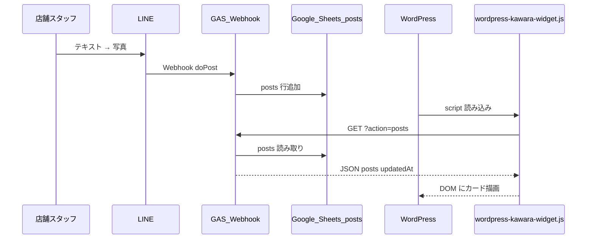

# 外浦MAP — WordPress かわら版 連携（エンジニア向け）

店舗スタッフが LINE で投稿した **かわら版** を、WordPress サイト上に一覧表示するための技術資料です。

**読者:** WordPress 実装担当・フロントエンド・インフラ  
**前提:** [LINE_INTEGRATION.md](../LINE_INTEGRATION.md)（LINE → GAS → Sheets の全体像）

---

## 1. 概要

| 項目 | 内容 |
|------|------|
| 目的 | LINE 投稿を WordPress ページに **読み取り専用** で表示 |
| データ源 | Google スプレッドシート `posts` タブ |
| API | GAS Web アプリ `doGet?action=posts`（JSON） |
| フロント | `web/wordpress-kawara-widget.js`（単体 JS・ビルド不要） |
| 秘密情報 | **WordPress 側に置かない**（GAS URL は公開可・GET のみ） |

マップ本体（GitHub Pages）とは **別経路** で同じ `posts` シートを参照します。

| 表示先 | 取得方法 |
|--------|----------|
| 外浦マップ（`index.html`） | gviz / `PostsModule`（シート ID は GitHub Secrets） |
| WordPress | GAS `doGet?action=posts` → ウィジェット JS |

---

## 2. アーキテクチャ



---

## 3. リポジトリ内のファイル

| パス | 役割 |
|------|------|
| [`web/wordpress-kawara-widget.js`](../wordpress-kawara-widget.js) | **WordPress 埋め込み用ウィジェット**（本番で `<script src>` するファイル） |
| [`web/gas-line-webhook.js`](../gas-line-webhook.js) | GAS に貼り付ける生成物（`doGet` / `doPost` 含む） |
| [`web/gas/line-webhook/06-routing.js`](../gas/line-webhook/06-routing.js) | `doGet` 実装（`action=posts`） |
| [`web/gas/line-webhook/03-sheets.js`](../gas/line-webhook/03-sheets.js) | `getPostsForApi_()` — posts シート → JSON |
| [`web/line-contract.js`](../line-contract.js) | `posts` 列定義（フロント契約） |
| [`web/LINE_INTEGRATION.md`](../LINE_INTEGRATION.md) | LINE 連携全体仕様 |

GAS ソースを変更した場合:

```bash
python web/gas/build-line-webhook.py
```

→ `gas-line-webhook.js` を GAS に反映し **新バージョンでデプロイ** してください。

---

## 4. 読み取り API 仕様

### 4.1 エンドポイント

```
GET {GAS_WEB_APP_URL}/exec?action=posts
```

| 項目 | 値 |
|------|-----|
| メソッド | GET のみ |
| 認証 | なし（公開読み取り） |
| CORS | ブラウザ `fetch` 用（GAS Web アプリ「全員」デプロイが必要） |
| キャッシュ回避 | ウィジェット側で `&_=timestamp` を付与 |

### 4.2 レスポンス

**Content-Type:** `application/json`

```json
{
  "posts": [
    {
      "postId": "uuid",
      "userId": "Uxxxxxxxx",
      "role": "store",
      "sourceType": "fixed",
      "title": "本日のおすすめ",
      "text": "（本文）",
      "imageUrl": "https://drive.google.com/thumbnail?id=...",
      "lat": 34.675,
      "lng": 138.943,
      "storeId": "店舗名",
      "createdAt": "2026-06-20T12:34:56.789Z"
    }
  ],
  "updatedAt": "2026-06-20T12:35:00.000Z"
}
```

### 4.3 フィルタ条件（GAS 側）

`getPostsForApi_()` が返す行:

- `postId` が空でない
- `isVisible !== FALSE`
- `title` / `text` / `imageUrl` のいずれかが非空

ソート: `createdAt` 降順（API 返却時点）。

### 4.4 JSONP（任意）

```
GET .../exec?action=posts&callback=handlePosts
```

→ `handlePosts({...})` 形式（`Content-Type: application/javascript`）。  
現行ウィジェットは **JSON + fetch** のみ使用。

### 4.5 `posts` シート列（12列）

| index | フィールド | WordPress 表示での利用 |
|-------|------------|------------------------|
| 4 | `title` | カード見出し |
| 5 | `text` | 本文 |
| 6 | `imageUrl` | 画像（Drive サムネ URL） |
| 9 | `storeId` | 店舗名ラベル・フィルタキー |
| 10 | `createdAt` | 投稿日時 |
| 11 | `isVisible` | `FALSE` は API に含めない |

詳細: [LINE_INTEGRATION.md §6](../LINE_INTEGRATION.md)

---

## 5. WordPress への組み込み

### 5.1 前提（GAS）

1. `web/gas-line-webhook.js` を GAS プロジェクトに配置
2. スクリプトプロパティ: `SHEET_ID`, `LINE_CHANNEL_ACCESS_TOKEN`（Webhook 用・API 読取にも SHEET_ID 必須）
3. **デプロイ → 新しいデプロイ → 種類: ウェブアプリ**
   - 実行ユーザー: **自分**
   - アクセス: **全員**（匿名ユーザーを含む）
4. デプロイ URL（`/exec` で終わる）を控える

### 5.2 ウィジェット JS のホスト

GitHub Pages 本番:

```
https://stand-koike.github.io/sotoura-map/wordpress-kawara-widget.js
```

`web/` がサイトルートとして公開されるため、パスに `web/` は **不要**。

### 5.3 埋め込みコード（カスタム HTML ブロック）

```html
<div id="sotoura-kawara-root"></div>
<script>
  window.SOTOURA_KAWARA_CONFIG = {
    gasUrl: 'https://script.google.com/macros/s/YOUR_DEPLOYMENT_ID/exec',
    storeId: '',
    maxItems: 12,
    pollIntervalMs: 60000
  };
</script>
<script src="https://stand-koike.github.io/sotoura-map/wordpress-kawara-widget.js"></script>
```

### 5.4 設定オブジェクト `SOTOURA_KAWARA_CONFIG`

| キー | 型 | 既定 | 説明 |
|------|-----|------|------|
| `gasUrl` | string | — | GAS Web アプリ URL（**必須**） |
| `rootId` | string | `sotoura-kawara-root` | 描画先要素の id |
| `storeId` | string | `''` | 指定時、その店舗の投稿のみ表示 |
| `maxItems` | number | `12` | 最大表示件数 |
| `pollIntervalMs` | number | `60000` | 自動再取得間隔（ms）。`0` でポーリングなし |

### 5.5 表示仕様（ウィジェット側）

- グリッドレイアウト（CSS は JS が `<style id="sotoura-kawara-styles">` で注入）
- タイトル未設定時: 本文先頭 14 字 or 「かわら版」
- HTML エスケープ済み（XSS 対策）
- 画像: `loading="lazy"`

---

## 6. セキュリティ

| 項目 | 方針 |
|------|------|
| GAS URL | 公開可（読み取り専用 GET） |
| LINE トークン / シート ID | GAS スクリプトプロパティのみ。**WP に書かない** |
| 書き込み | WordPress からは不可。投稿は LINE Webhook のみ |
| 画像 URL | Google Drive「リンクを知っている全員」サムネ。フロントは `` で直接参照 |

---

## 7. トラブルシュート

| 症状 | 確認ポイント |
|------|----------------|
| 「GAS URL を設定してください」 | `SOTOURA_KAWARA_CONFIG.gasUrl` が空 or プレースホルダ |
| 「かわら版の取得に失敗しました」 | GAS が「全員」アクセスか / CORS / デプロイ URL が `/exec` か |
| 常に空 | `posts` シートに行があるか / `isVisible` が FALSE になっていないか |
| 画像が出ない | Drive 共有設定 / `imageUrl` 列の URL 形式 |
| マップには出るが WP に出ない | マップは gviz、WP は GAS API。**別経路**のため GAS デプロイ・URL を個別確認 |
| 更新が遅い | `pollIntervalMs` を短くする（負荷とのトレードオフ） |

### 7.1 API 単体確認

ブラウザまたは curl:

```
https://script.google.com/macros/s/YOUR_ID/exec?action=posts
```

JSON で `posts` 配列が返れば API は正常。

---

## 8. 変更時のチェックリスト

- [ ] GAS: `gas/line-webhook/` 編集 → `build-line-webhook.py` → 再デプロイ
- [ ] WordPress: `gasUrl` が最新デプロイ URL を指しているか
- [ ] `posts` 列変更時: `line-contract.js` / GAS `01-contract.js` / 本ドキュメント §4.5 を同期
- [ ] ウィジェット UI 変更: `wordpress-kawara-widget.js` のみ編集 → push → Pages 反映

---

## 9. 関連ドキュメント

| 資料 | 対象 |
|------|------|
| [LINE_INTEGRATION.md](../LINE_INTEGRATION.md) | LINE・GAS・シート全体 |
| [LINE_ONBOARDING.md](./LINE_ONBOARDING.md) | 店舗・運営向け手順（非エンジニア） |
| [gas/README.md](../gas/README.md) | GAS モジュール構成・ビルド |
| [SECURITY.md](../../SECURITY.md) | 秘密情報の扱い |

---

## 10. 連絡・引き継ぎメモ（記入用）

| 項目 | 値 |
|------|-----|
| GAS Web アプリ URL | `https://script.google.com/macros/s/____________/exec` |
| スプレッドシート ID | `16E1nAfvtlVSVCaXfHSfzlAWIAHXeuQWudxFssreehy4` |
| WordPress 設置ページ | （例: トップ / 店舗一覧下） |
| 店舗別表示（`storeId`） | 全件 / 店舗名指定 |
| 担当 | |
